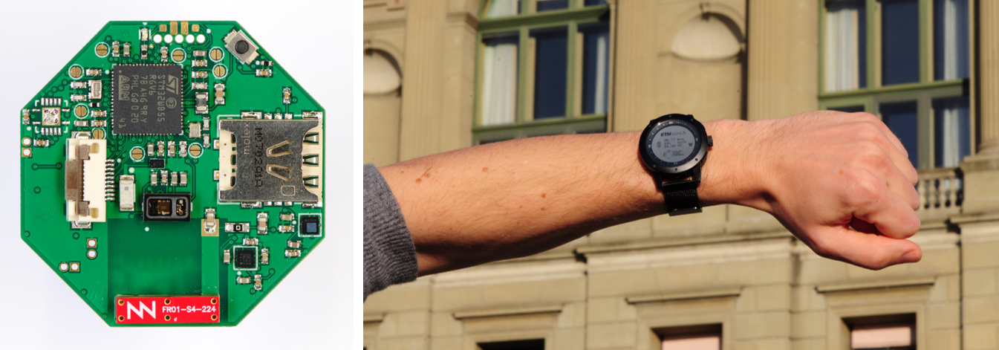

<!--
*** Template source: https://github.com/othneildrew/Best-README-Template/blob/master/README.md
-->

<!-- PROJECT SHIELDS -->
<!--
*** I'm using markdown "reference style" links for readability.
*** Reference links are enclosed in brackets [ ] instead of parentheses ( ).
*** See the bottom of this document for the declaration of the reference variables
*** for contributors-url, forks-url, etc. This is an optional, concise syntax you may use.
*** https://www.markdownguide.org/basic-syntax/#reference-style-links
-->
[![Contributors][contributors-shield]][contributors-url]
[![Forks][forks-shield]][forks-url]
[![Stargazers][stars-shield]][stars-url]
[![Issues][issues-shield]][issues-url]
[![License][license-shield]][license-url]

<!-- PROJECT LOGO -->
 

  

  <h3 align="center">H-Watch</h3>

  

    Smart Watch for Healthcare
     
    <a href="https://github.com/ETH-PBL/H-Watch"><strong>Explore the docs »</strong></a>
     
     
    <a href="https://www.youtube.com/watch?v=JSp1-hzvBWk">View Demo</a>
    ·
    <a href="https://github.com/ETH-PBL/H-Watch/issues">Report Bug</a>
    ·
    <a href="https://github.com/ETH-PBL/H-Watch/issues">Request Feature</a>
  

<!-- TABLE OF CONTENTS -->
## Table of Contents

* [About the Project](#about-the-project)
* [Hardware](#hardware)
  * [Components](#hardware)
  * [PCB](#pcb) 
* [Getting Started](#getting-started)
  * [Software](#software)
  * [Installation](#installation)
  

<!-- ABOUT THE PROJECT -->
## About The Project

The H-Watch is a fully open-sourde wearable long-lasting smart monitoring platform for health monitoring and tracking. Thanks to the integrated state-of-the-art NB-IoT cellular technology, it provides direct and secure cloud connectivity. It  is  based  on  widely  available  off-the-shelf components; however, it is designed with low-power and on-board intelligence in mind. Experimentalresults demonstrated only 5.9 mW of average power consumption, leading to a lifetime of 9 days on a small watch battery wothout, and up to 20 days with the solarenergy harvester.

## Hardware

### Components
The H-Watch is a highly integrated multi-sensor wearable platform which is built of the key components, listed below: 

* [MAX30101EFD+][max301010_url],  High-Sensitivity Pulse Oximeter and Heart-Rate Sensor for Wearable Health
* [LSM303AGR][lsm303agr_url],     Ultra-compact high-performance eCompass module
* [LPS22HB][lps22hb_url],         MEMS nano pressure sensor
* [LSM6DSM][lsm6dsm_url],         Ultra-low power, high accuracy and stability iNEMO 6DoF inertial measurement unit (IMU)
* [MP34DT05-A][mp34dt05_url],     MEMS audio sensor omnidirectional stereo digital microphone
* [BQ25570][bq25570_url],         Ultra Low power Harvester power Management IC with boost charger, and Nanopower Buck Converter
* [STM32WB55RG][stm32wb55_url],   Ultra-low-power dual core Arm Cortex-M4, Cortex-M0+ with 1 Mbyte of Flash memory, Bluetooth LE 5.2
* [BC95GJB-02-STD][bc95G_url],    Multi-band NB-IoT Module with Ultra-low Power Consumption

The H-Watchs housing, as well as its energy-saving memory LCD display, was taken from the [Matrix Power Watch][powerwatch_url] series 1.

### PCB 
The H-Watchs printed circuit board (PCB) is built of 6 Layers with a total board thichness of only 0.83mm. Further informations about the PCB can be found here:

File                                    | Content
----------------------------------------|--------
[H-Watch_schematics.pdf]                | Schematics of the H-Watch.  
[H-Watch_connectors. pdf]               | Description of the position and functionality of all connectors and test pionts.
[H-Watch_assembly.pdf]                  | Assembly drawings of the top- and bottom-side of the PCB.
[H-Watch_manufacturing.pdf]             | Detailed fabrication information about the exansion board; thickness, dimensions and defined layer stack.
[H-Watch_layers.pdf]                    | Routing overview of all six copper layers.
[H-Watch_3D.pdf]                        | 3D model of the H-Watches hardware
[H-Watch_complete_documentation.pdf]    | The complete documentation contains all files above, excluding the 3D-PDF

The latest Altium files of of the PCB can be found [here][latest_altium_files]

<!-- GETTING STARTED -->
## Getting Started

#### Software

### Installation

<!-- MARKDOWN LINKS & IMAGES -->
<!-- https://www.markdownguide.org/basic-syntax/#reference-style-links -->

<!--Subsection Hardware-->
[max301010_url]:    https://www.maximintegrated.com/en/products/interface/sensor-interface/MAX30101.html
[lsm303agr_url]:    https://www.st.com/en/mems-and-sensors/lsm303agr.html
[lps22hb_url]:      https://www.st.com/en/mems-and-sensors/lps22hb.html
[lsm6dsm_url]:      https://www.st.com/en/mems-and-sensors/lsm6dsm.html
[mp34dt05_url]:     https://www.st.com/en/mems-and-sensors/mp34dt05-a.html
[bq25570_url]:      https://www.ti.com/product/BQ25570
[stm32wb55_url]:    https://www.st.com/en/microcontrollers-microprocessors/stm32wb55rg.html
[bc95G_url]:        https://www.quectel.com/UploadFile/Product/Quectel_BC95-G_NB-IoT_Specification_V1.2.pdf
[powerwatch_url]:   https://www.powerwatch.com/collections/powerwatch/products/black-ops-pack-10  

<!--Subsection PCB-->

[current_version]:  H-Watch_V0.2

[H_Watch_schematics.pdf]:                 /Hardware/[current_version]/Documentation/H-Watch_schematics.PDF
[H_Watch_connectors. pdf]:                /Hardware/H-Watch_V0.2/Documentation/H-Watch_connectors.PDF
[H_Watch_assembly.pdf]:                   /Hardware/H-Watch_V0.2/Documentation/H-Watch_assembly.PDF
[H_Watch_maufacturing.pdf]:               /Hardware/H-Watch_V0.2/Documentation/H-Watch_manufacturing.PDF
[H-Watch_layers.pdf]:                     /Hardware/H-Watch_V0.2/Documentation/H-Watch_layers.PDF
[H-Watch_3D.pdf]                          /Hardware/H-Watch_V0.2/Documentation/H-Watch_3D.PDF
[H-Watch_complete_documentation.pdf]      /Hardware/H-Watch_V0.2/Documentation/H-Watch_complete_documentation.PDF
[latest_altium_files]:                    /Hardware/H-Watch_V0.2/   

[contributors-shield]: https://img.shields.io/github/contributors/tommasopolonelli/SynthSense-WSN-UAV.svg?style=flat-square
[contributors-url]: https://github.com/tommasopolonelli/SynthSense-WSN-UAV/graphs/contributors
[forks-shield]: https://img.shields.io/github/forks/tommasopolonelli/SynthSense-WSN-UAV.svg?style=flat-square
[forks-url]: https://github.com/tommasopolonelli/SynthSense-WSN-UAV/network/members
[stars-shield]: https://img.shields.io/github/stars/tommasopolonelli/SynthSense-WSN-UAV.svg?style=flat-square
[stars-url]: https://github.com/tommasopolonelli/SynthSense-WSN-UAV/stargazers
[issues-shield]: https://img.shields.io/github/issues/tommasopolonelli/SynthSense-WSN-UAV.svg?style=flat-square
[issues-url]: https://github.com/tommasopolonelli/SynthSense-WSN-UAV/issues
[license-shield]: https://img.shields.io/github/license/tommasopolonelli/SynthSense-WSN-UAV.svg?style=flat-square
[license-url]: https://github.com/tommasopolonelli/SynthSense-WSN-UAV/blob/master/LICENSE
[product-screenshot]: images/screenshot.png
